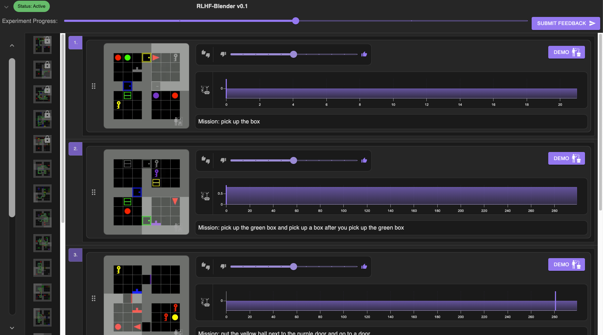
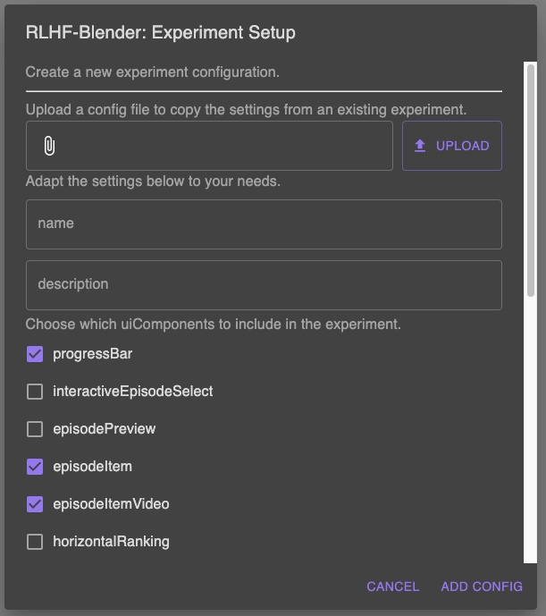
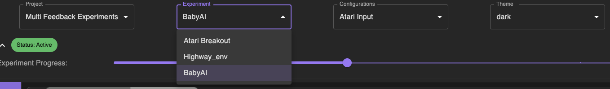

.. _quickstart:

===============
Getting Started
===============

If you have chosen the Docker installation, you can start the applciation via `docker-compose up`.
For the manual installation, you can start the Python backend via `python rlhfblender/app.py` and the frontend via `npm start` called from the `rlhfblender-ui`-subdirectory.

The application is then reachable at http://localhost:3000.

    
    A view of the user interface of the application showing "BabyAI". The environement is pre-configured for a study.

Configuring
-----------
There are two types of configuration you can do: The configruation for the backend (i.e., which environment to run, which data to load, which models to train with the human feedback, etc.),
and the configuration for the user interface (i.e.,  which feedback is enabled in the UI, which elements to show to the user).

The backend configuration can be either done by loading a YAML file via the `--backend-config` command line argument giving the path to the YAML file. 
By default, the application will look in the `configs`directory for a `default_backend_config.yaml`.

The frontend configuration can be done by loading a JSON file via the `--ui-config` command line argument giving the path to the JSON file.
By default, the application will look in the `configs`directory for a `default_ui_config.json`.

The configuration can also be done via the frontend interface:

    
    Configuration of the application via the frontend interface.

Run experiments
---------------

You can set the configuration to run experiments with the application.
The application can be served in two modes: `config` and `experiment`.

In `config` mode, the application provides you with full access to configurations and the data.
Use this mode to try out different options and configure the application according to your needs.

    
    In the config mode, controls to choose the environment and configurations are available for individual configuration of the application.

In `experiment` mode, the application will run the experiment as configured in the backend configuration.
The application can then be served to participants. During the experiment, the application will log the actions of the participants and the results of the experiment.

Export results
--------------

Finally, you can export the results of the experiment.
The application will export the results as a CSV file containing the actions of the participants and the results of the experiment.

Log files and generated data are stored on the local file system in the `data` and `logs` directories.
You can also download them from a remote server by calling `url:port/retrieve_logs`, url:port/retrieve_demos` and `url:port/retrieve_feedback`.

Train models
------------

Coming soon.