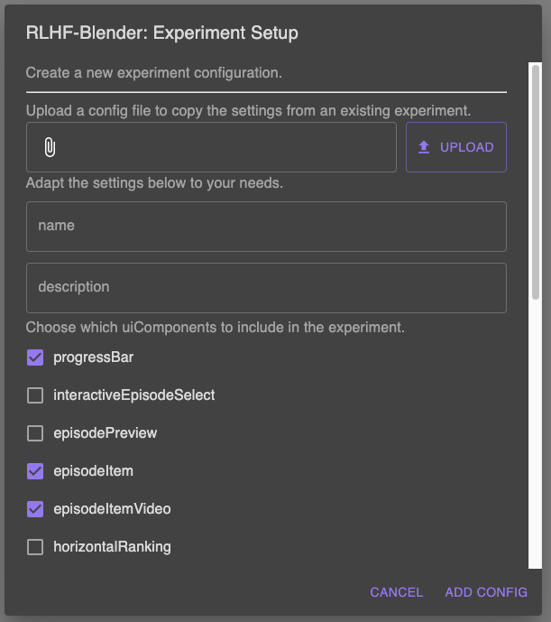

.. _setup_experiment:

===============================
Setup and Configure Experiments
===============================

First register a project/environment/experiment and generate recordings using the
:download:`Dash or MiniGrid project guide <../../new_project.md>`.
A saved setup references these existing records; it does not create recordings or train a policy.

Configure in the frontend
-------------------------

1. Open http://localhost:3000 without a study code. This opens configuration mode.
2. Expand the top menu if it is collapsed, then select **Project**, **Experiment**,
   and **Checkpoint**. For the guide's baseline, choose **Random**.
3. Select a **Backend Config** and **UI Config**. Use the adjacent configuration
   controls to customize sampling and feedback types.
4. Confirm that the recorded episodes load and that the feedback interface behaves
   as intended.
5. Click **Save Setup**. Keep the returned study code and participant link.

    The configuration dialog; available options depend on the frontend revision.

URLs
----

- Configuration: ``http://localhost:3000``
- Saved study: ``http://localhost:3000/?study=CODE``
- Active-learning configuration: ``http://localhost:3000/?study_mode=active-learning``
- Saved active-learning study: ``http://localhost:3000/?study_mode=active-learning&study=CODE``

The current query parameter is ``study_mode``. Older examples using port ``5000``
or ``studyMode=configure`` do not describe this branch.

Configuration files
-------------------

Setup snapshots are stored as ``configs/setups/<study-code>.json``. UI and backend
configuration files are JSON under ``configs/ui_configs/`` and
``configs/backend_configs/`` respectively. A setup includes the selected project,
experiment, checkpoint, UI configuration, and backend configuration.

For Docker, these configuration directories are inside the backend image, without
host bind mounts. Copy any newly saved configurations to the host before recreating
the container. Share the relevant configurations together with the database and
generated data; a study code alone is not a portable study.

Dash demonstrations
-------------------

The Dash iframe uses browser-facing addresses. Compose passes both
``VITE_DASH_PLAYER_URL`` and ``VITE_DASH_PLAYER_ORIGIN`` as frontend build arguments,
defaulting to ``http://localhost:5173``. For remote clients, override both in the
repository-root ``.env`` and rebuild the frontend. For development without Docker,
set them in the frontend's ``.env.local`` instead. These settings are separate from
the backend's container-network ``DASH_PLAYER_URL=http://dash-driving:5173``.
